# Keyboards

Experiences and measurements with different keyboards over the years

## Measurements

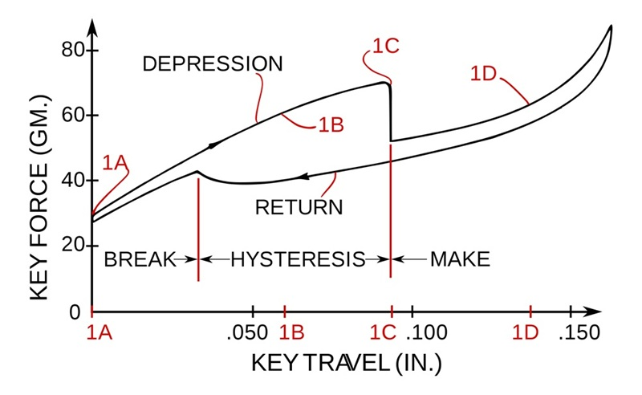

With the Covid-19 pandemic the interest in mechanical keyboards got a global spike, and the niche hobby became more mainstream. Good products became affordable. I started a setup to measure the force-travel curve of the Apple butterfly keyboard in 2017, but never finished the project. In 2023 - 6 years later - more sophisticated and automated solutions are available. And the source code and results are available on Github:

- [Open-Switch-Curve-Meter](https://github.com/bluepylons/Open-Switch-Curve-Meter)
- [ThereminGoat/force-curves](https://github.com/ThereminGoat/force-curves)
- [Linus gave his Model M away before 2012](https://www.youtube.com/watch?v=hkmBzKTuE2w), [The Greatest Keyboard - 2018](https://www.youtube.com/watch?v=D7wmMZmMinM)

The force-travel graph on the right is from the buckling spring patent filing [US4118611](https://patents.google.com/patent/US4118611/en) from 1978.

## Comparison table

| keyboard         | distance [mm] | force [cN] | source          |
|------------------|:-------------:|:----------:|-----------------|
| MacBook 12       |           0.5 |            |                 |
| MacBook Air 2020 |           0.9 |         63 | [rting.com](https://www.rtings.com/laptop/reviews/apple/macbook-air-13-m1-2020)       |
| Logitech K585    |           1.8 |         64 | [rting.com](https://www.rtings.com/keyboard/1-3-1/graph/23175/key-switch-actuation-graph/logitech-k585-vs-apple-magic-keyboard-2017/38163/1601)       |
| Akko 3098 B Plus |           3.5 |         56 | [V3 Cream Yellow](https://github.com/ThereminGoat/force-curves/tree/main/Akko%20V3%20Cream%20Yellow) |
| Aula F75         |           3.6 |         55 | [Leobog Reaper](https://github.com/ThereminGoat/force-curves/tree/main/Leobog%20Reaper)   |
| [Model M keyboard](https://en.wikipedia.org/wiki/Model_M_keyboard) |  4.0 |  70 | [Bluckling spring](https://en.wikipedia.org/wiki/Buckling_spring),  [force-travel graph](https://sharktastica.co.uk/resources/images/patents/US4118611A_2.jpg) |

Two related patents are [US4118611A](https://patents.google.com/patent/US4118611/en) Buckling spring torsional snap actuator from 1978 and [Catastrophically buckling compression column switch and actuator](https://patentimages.storage.googleapis.com/36/4b/99/36af15e33d4aff/US3699296.pdf) ([US3699296A](https://patents.google.com/patent/US3699296A/en)) from 1972.

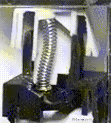 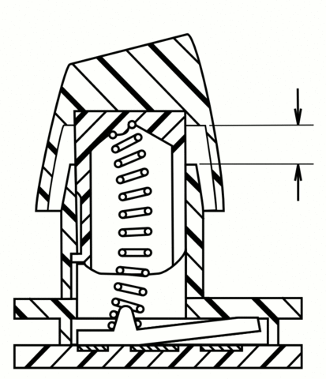 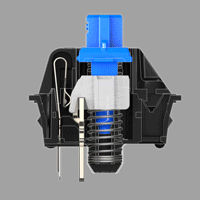 

## History

Weirdly enough in 1990 I took a 10 finger type course on mechanical typewriters. I think the travel distance for these keys is more than 10 millimeter. For the C64 and Atari ST (from the 1980) it should already be around the future 4 millimeter. The above mentioned patent filing from 1978 includes a [graph that indicates](https://sharktastica.co.uk/resources/images/patents/US4118611A_2.jpg) that the keypress is registered after 0.08 inch (2.0 millimeter) and bottoms out at 0.17 inch (4.3 millimeter) with 70 cN force. These values are probably reference range values for this time. The necessity for less key travel appeard later with the rise of slim laptops, and a process of low key travel exploration began.

###  1988 ZX81

My first computer, a [ZX81](https://en.wikipedia.org/wiki/ZX81), had a 40-key membrane keyboard. While usable, it was not very comfortable to use for longer time or write a program on in. The layout of the 13 (8x5) data lines was well documented. 

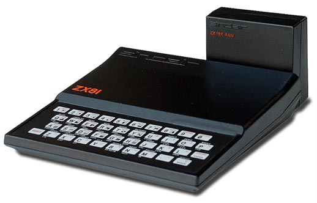

The layout of the 13 (8x5) data lines to the keyboard are part of the documented schematics:

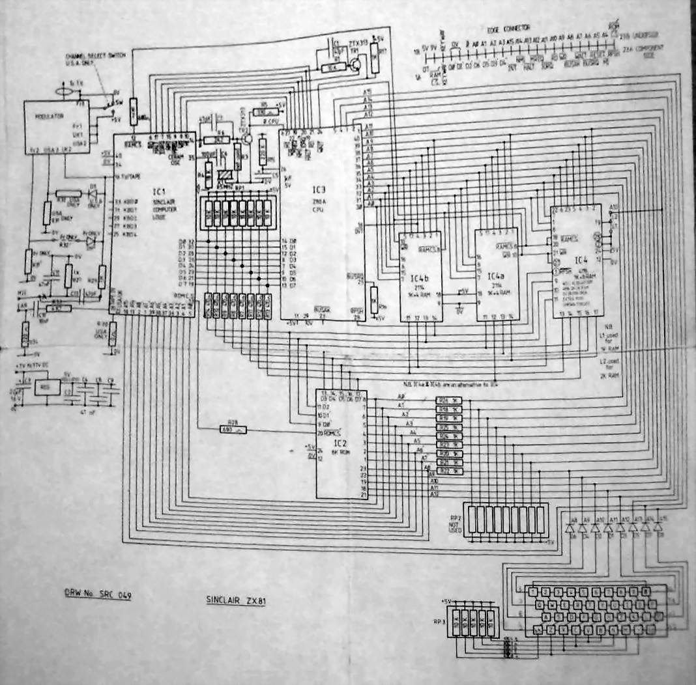

This inspired me for my first custom made keyboard:

### 1991 ZX81 Keyboard hack

I got a bare [C64](https://en.wikipedia.org/wiki/Commodore_64) keyboard from Völkner Electronic in Berlin. To safe the 75 Pfennigs (34 cents) for a 2 hour public transportation ticket it got there from Falkensee with my bicycle.

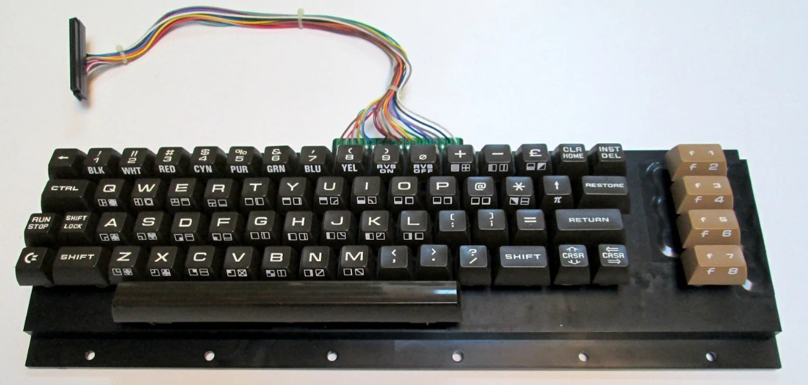

Then it was time to rewire the PCB to match the 8x5 assignment of the 40 keys of the ZX81. 

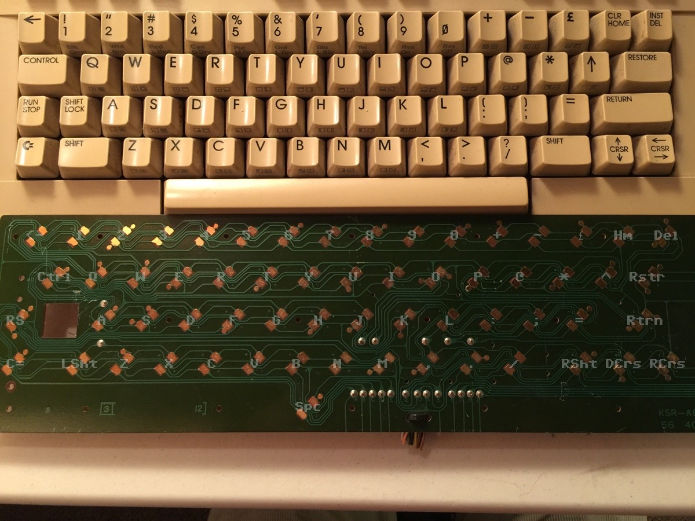

### 1993 external housing for the Atari STFM 520 keyboard

My Atari was a AIO machine, while friends used PCs with external keyboards. Wouldn't it be nice if the Atari could be converted to this form factor? The PCB is larger than AT machines of this time, so a custum made shell from 3mm Aluminum was created:

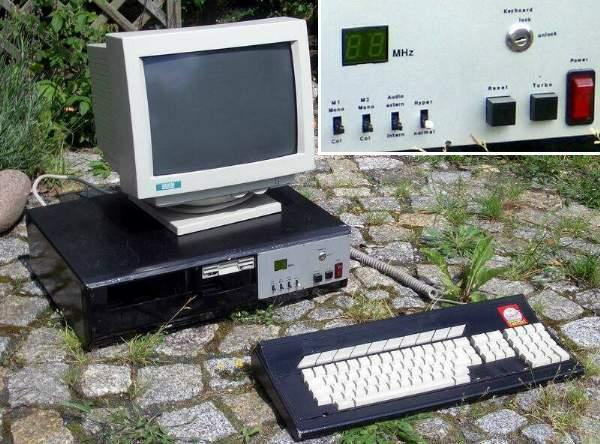

### 2003 a great IBM keyboard with the Thinkpad X30

For my 1 year study abroad in Moscow I got my first laptop - a 12 inch IBM Thinkpad X30. The keyboards of these old IBM machines are phantastic!

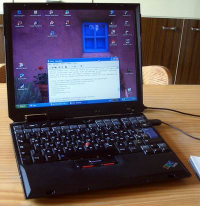

### 2017 just 0.5 mm key travel with the Butterfly keyboard on a MacBook 12

The MacBook was a great engineering achievement with a full aluminum body, retina display and just 900 gramm weight. A lot had changed since my first laptop, a Thinkpad X30 from 2003. One of the many changes was the new keyboard, named "butterfly keyboard" by Apple. The keycaps were really large, the backlight just under the letters superb (almost no light bleeding to the edges) but the shallow key travel of only 0.5 millimeter was something most people never could get used to.

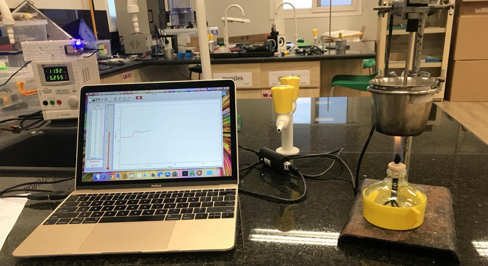

### 2018 Setup to measure force-travel curves

By April 13, 2018, I had the setup completed with the [dual range force meter](https://www.vernier.com/product/dual-range-force-sensor/) from [Vernier](https://www.vernier.com/). It has a resolution of 0.01 N or 1 cN, which is probably sufficient for the usual 40 cN acctuation force for Chery red switches.

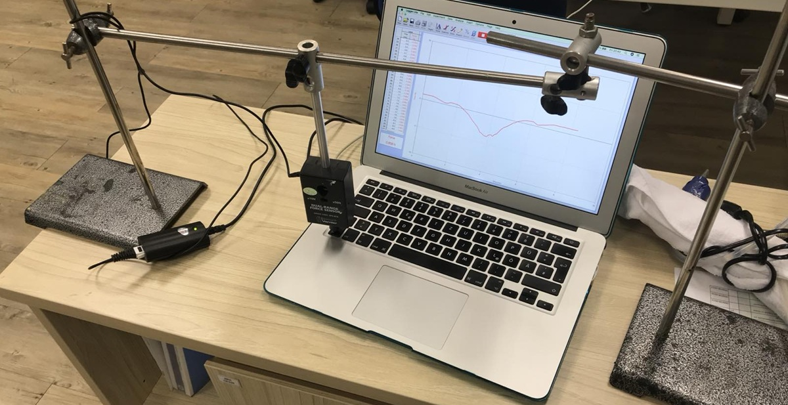

### 2025 hot swap mechanical

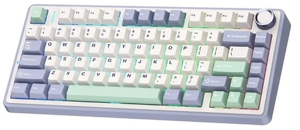 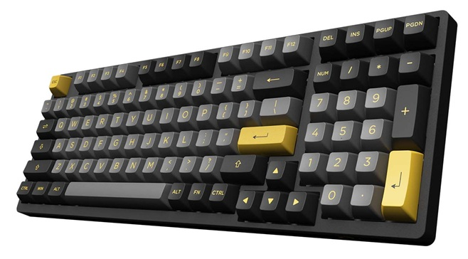

By now you can get so many mechanical keyboards, all kinds of RGB backlights and more than 2000 different switches to put in. I got the Akko 3098 B Plus with [Akko V3 Cream Yellow](https://www.switchesdb.com/#Akko%20V3%20Cream%20Yellow~TG.csv) and Aula F75 with [Leobog Reaper](https://www.switchesdb.com/#Leobog%20Reaper~TG.csv) switches. On the former I changed to the [Outemu Silent Lemon V3](https://www.switchesdb.com/#Outemu%20Silent%20Lemon%20V3~TG.csv) switches. For people that have a job.

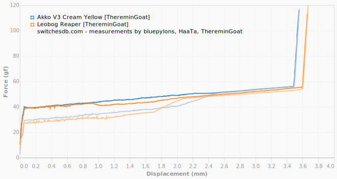

This is the change to silent Outemu switches on the Akko 3098B:

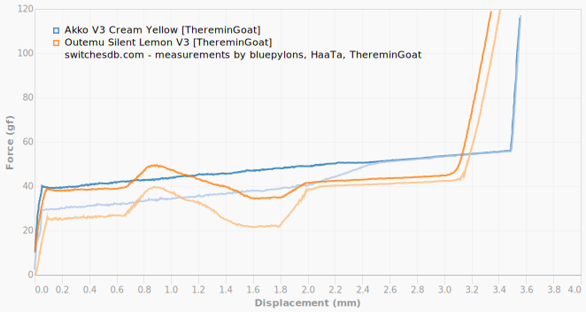

A force-travel update to my 3D printer is a future project. And to build my own keyboard with a [Lucky 65 V2](https://kietmodphimdao.com/san-pham/kit-ban-phim-co-lucky65-v2/), some salvaged Akko CS Yellow Cream V3 switches and matching [red/purple keycaps](https://kietmodphimdao.com/san-pham/keycap-gardient-black-red/).

## Progressive Spring

Some switches how have progressive springs, and many motorbikes on the road around me have this type of spring as well. A [post on geekhack.org](https://geekhack.org/index.php?topic=112430.msg3040866#msg3040866) from 2021 illustrates that the effect itself is almost neglible:

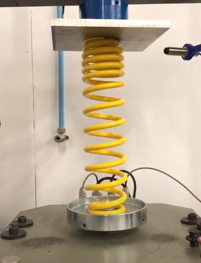 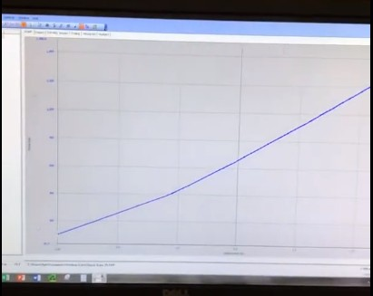

Another example is this [article on imsolidstate.com](https://www.imsolidstate.com/archives/1693) form 2017. And when used in a keyboard it might be even less obvious in the force-travel diagram, let alone possible to feel. See [Tecsee Progressive Spring](https://github.com/ThereminGoat/force-curves/blob/aed248b47703958b065d2d05909e8558471e7288/SwitchOddities%20Spring%20Testers/Tecsee%20Progressive/Tecsee%20Progressive%20Linear.pdf) ([github folder](https://github.com/ThereminGoat/force-curves/tree/aed248b47703958b065d2d05909e8558471e7288/SwitchOddities%20Spring%20Testers/Tecsee%20Progressive)). 

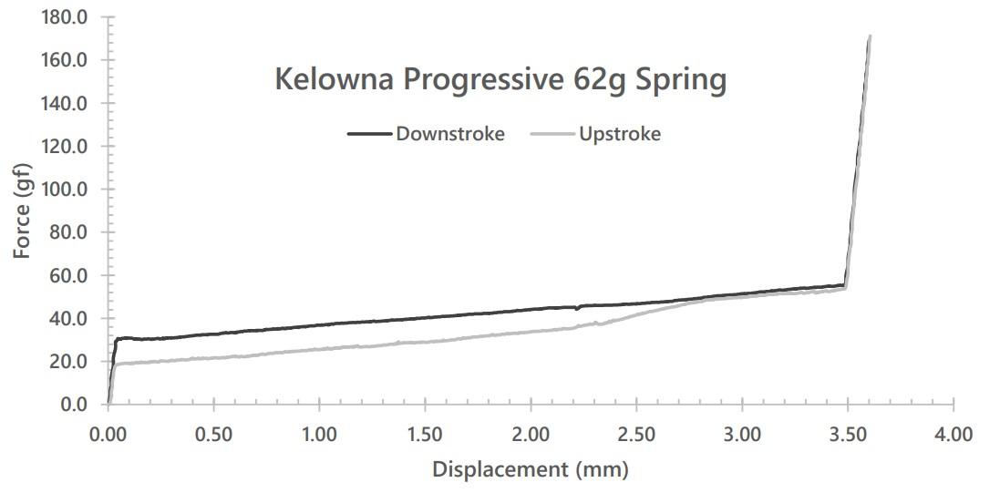
